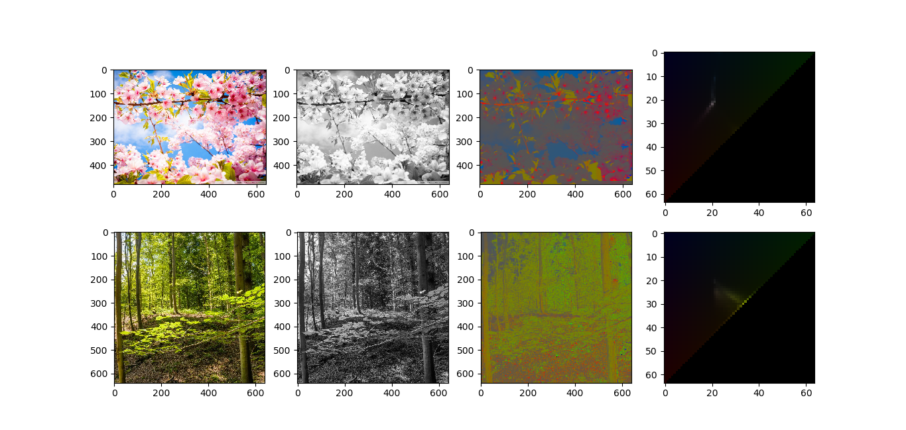
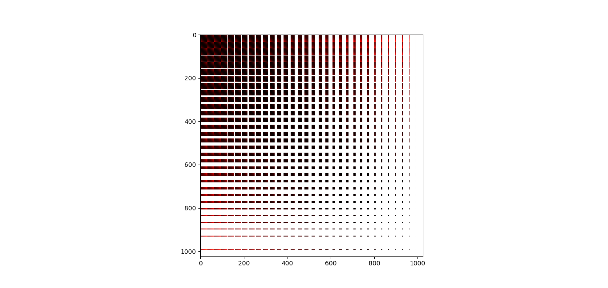
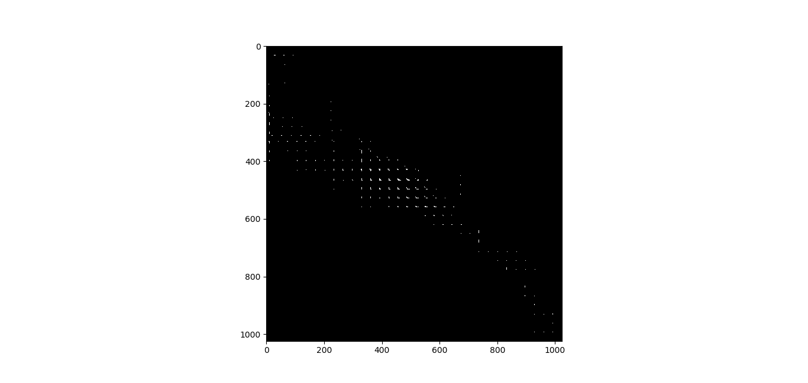
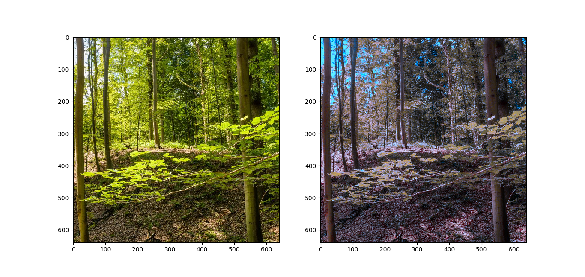

#Sparse Optimal Transport

So, start off... given two images X and Y we want to transfer Y's colors to X's colors.
To reduce the amount of variables, I've decided to use convert colorspaces to I= R+G+B, r = R/I, g = G/I.

We gather histograms for r and g in both images. Next, we have to calculate the Optimal Transport between hX and hY.

In their paper, they propose a primal-dual transformation. I've implemented this coupled with non-linear conjugate gradient ascent.

Using the following distance on points in the discretized triangle:

We find the following transport map, T, after solving the dual problem:

And calculating the new colors and transforming Y's colors, we find:

